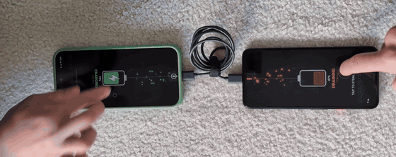

# ⚡️ Power Struggle

[日本語版はこちら](README_ja.md)

**A two-player tap battle over USB-C where you physically steal battery power from your opponent.**

Connect two phones with a USB-C cable and tap. Whoever is winning actually gets charged; the loser's battery really drains. For those "We're both at 5% and neither can make it home, but one of us could survive if they take the other's charge" standoffs.

📖 Project page: **[kenkawamoto.com/projects/power-struggle](https://kenkawamoto.com/projects/power-struggle)**

<p align="center">
  <a href="https://kenkawamoto.com/projects/power-struggle"></a>
  <br>
  <sub>▶ <a href="https://kenkawamoto.com/projects/power-struggle">Watch the full video</a></sub>
</p>

<p align="center">
  
  &nbsp;&nbsp;
  
</p>
<p align="center"><sub>Left: two-phone mode, the winning side. Right: one-phone mode against an iPad, which can't run the app but still swaps power.</sub></p>

## How to play

- The two phones lie on the table **bottom to bottom**, joined by the cable, with a player behind each one. (That's why the UI is drawn upside down.)
- Tap anywhere to pull the knot on the energy stream towards your battery. It springs back towards the cable on its own.
- When the knot passes the line just beyond the cable, power swaps and flows to you. The phone's own status bar charging icon is your proof.
- Faster tapping = more of your opponent's battery. Losing actually costs you charge.

If the other device isn't running the app (not installed, or an iPad/iPhone), one phone shows both players on a split screen and still swaps power with the other device.

## Try it yourself

No computer is needed. Setting up takes about 10 minutes the first time, almost all of it on one phone.

### What you need

- **Phone A, the "host" phone:** an Android phone running Android 13 or newer. This phone does the actual power switching. It has only been tested on Google Pixel phones; other brands may not work.
- **Device B, the opponent**, one of:
  - another Android phone with a USB-C port and Android 13 or newer (both players get their own screen), or
  - an iPad, a USB-C iPhone (iPhone 15 or later), or an older Android phone. These can't run the app, so Phone A shows both players on a split screen, but power still really moves between the two.
- **A USB-C to USB-C cable that carries data.** The cable that came in the box with a recent phone works. Some cheap cables only carry power and won't work.
- **Wi-Fi** on Phone A during setup.

### Step 1: Install the app

Do this on Phone A, and also on Device B if it's an Android phone.

1. On the phone, open **[the download page](https://github.com/kenkawakenkenke/power-struggle/releases/latest)**, and under **Assets** tap the file ending in **.apk** to download it.
2. Open the downloaded file (from the download notification, or from the **Files** app → **Downloads**).
3. The first time, Android says your browser isn't allowed to install apps. Tap **Settings**, turn on **Allow from this source**, then go back.
4. Tap **Install**. If Google Play Protect warns that the app is unrecognized, tap **More details** → **Install anyway**. (It warns because the app isn't from the Play Store.)

### Step 2: Set up Shizuku (Phone A only)

Switching which phone charges which is normally only possible from a computer. A free app called **Shizuku** lets Power Struggle do it from the phone itself. Device B doesn't need it.

1. **Install Shizuku** from the [Google Play Store](https://play.google.com/store/apps/details?id=moe.shizuku.privileged.api).
2. **Turn on Developer options.** Open **Settings** → **About phone**, and tap **Build number** seven times. Enter your PIN if asked. You'll see "You are now a developer!"
3. **Pair Shizuku.**
   1. Open Shizuku. Under **Start via Wireless debugging**, tap **Pairing**, and allow notifications if asked.
   2. Open **Settings** → **System** → **Developer options** → **Wireless debugging**. Turn it on and confirm.
   3. Tap **Pair device with pairing code**. A six-digit code appears.
   4. Pull down the notification shade. Shizuku's notification has a box to type the code into. Enter the code there and send it. You should see "Pairing successful".
4. **Start Shizuku.** Go back to Shizuku and tap **Start** under **Start via Wireless debugging**. The top of the Shizuku screen should now say **Shizuku is running**.

You only pair once. **After the phone restarts, Shizuku stops**, so just open Shizuku and tap **Start** again (with Wi-Fi on; if it complains, turn **Wireless debugging** back on first).

Shizuku's own guide has screenshots if you get stuck: [shizuku.rikka.app/guide/setup](https://shizuku.rikka.app/guide/setup/).

### Step 3: Play

1. Open Power Struggle on Phone A (and on Device B, if it's an Android phone with the app).
2. Lay the phones on the table bottom to bottom, and plug them together with the cable.
3. Accept the pop-ups. These appear the first time only:
   - on Phone A, **allow Power Struggle to use Shizuku** (choose **Allow all the time**), then **allow it to access the USB device** (tick "always open" if offered, then **OK**);
   - on Device B, **allow Power Struggle to open** when it asks about the USB accessory.
4. Within a few seconds the screens show **CHARGING** or **DRAINING**. Start tapping!

### If something doesn't work

- **The screen keeps saying "Connect the other phone".** Unplug the cable and plug it back in. If that doesn't help, try a different cable; it may be a charge-only cable.
- **Phone A doesn't switch power.** Open Shizuku and check that it says **Shizuku is running**. If the phone has restarted since setup, tap **Start** again.
- **Both phones are Android and both have Shizuku running.** Only one phone should. Stop Shizuku on Device B (or simply don't start it after a restart).
- **A phone with a very low battery won't give power.** Some phones refuse to supply power when they're nearly empty. Charge it a little and try again.

### Afterwards

- **To undo everything:** uninstall Power Struggle and Shizuku, and in **Settings** → **System** → **Developer options**, turn off **Wireless debugging** (or the whole **Developer options** switch at the top).
- **Is it bad for the battery?** No more than normal use. About 4.5 W flows between the phones, which is gentler than any ordinary charger. But the loser really does lose charge, so don't play with a phone you need to keep alive.

## How it works

**Swapping who charges whom.** A USB-C port on a modern phone can either supply power (source) or receive it (sink). When two phones are connected, USB Power Delivery decides which is which, and the spec also allows a _power role swap_ mid-connection without unplugging. That's what Android's "Charge connected device" USB setting does. Power Struggle triggers the same swap from inside the game by running

```
dumpsys usb set-port-roles <port> <source|sink> <host|device>
```

That needs shell-level permission, so the app runs it through [Shizuku](https://shizuku.rikka.app/), which lends an app the permissions of an adb shell. No root required. Only one phone needs this: the swap is negotiated between the two phones, and the other just accepts the request. A swap takes about half a second; afterwards roughly 4.5 W (5 V, 0.9 A on a Pixel) flows the other way.

**Game data over the same cable.** The phone running Shizuku takes the USB _host_ role and switches the other phone into [Android Open Accessory](https://source.android.com/docs/core/interaction/accessories/protocol) mode, a protocol originally meant for car head units and docks. That gives the two phones a direct, millisecond-latency data channel for taps and game state. Power role and data role are independent in USB, so the link stays up while power flips back and forth underneath it.

**Truthful UI.** Each phone's "charging / draining" display comes from its own `BatteryManager` readings, not from game messages, so the screen shows what the battery is actually doing.

Measured on a Pixel 9 Pro XL ↔ Pixel 4 XL: the supplying phone's battery drains at around 1500 mA while the receiving phone's battery gains only around 400 mA. Both screens and the animation eat into the roughly 4.5 W delivered, so use it only in a genuine emergency.

## Status and caveats

This is a proof of concept, tested only on Pixels (and against an iPad).

- `dumpsys usb set-port-roles` is a debug interface, not a public API. Other manufacturers' builds or future Android versions may not support it.
- Some phones won't supply power when their own battery is low, and the app doesn't yet enforce a battery floor of its own. Don't play it with a phone you need to keep alive.
- iPads/iPhones can't run the app over USB (no Android Open Accessory), so they're power-only opponents in one-phone mode.

## Building from source

For developers. Requires JDK 17+ and the Android SDK.

```sh
./gradlew installDebug      # build and install a debug build on a connected phone
./gradlew assembleRelease   # build app/build/outputs/apk/release/app-release.apk
```

Release builds are signed when `POWER_STRUGGLE_STORE_FILE`, `POWER_STRUGGLE_STORE_PASSWORD`, `POWER_STRUGGLE_KEY_ALIAS` and `POWER_STRUGGLE_KEY_PASSWORD` are set in `~/.gradle/gradle.properties`; otherwise the release APK is unsigned.

## Code tour

| File                                                                                                                                                                       | What it does                                                             |
| -------------------------------------------------------------------------------------------------------------------------------------------------------------------------- | ------------------------------------------------------------------------ |
| [`Battle.kt`](app/src/main/java/com/kenkawamoto/powerstruggle/Battle.kt)                                                                                                   | Game state, tug-of-war rope, one/two-phone mode detection, wire protocol |
| [`PowerControl.kt`](app/src/main/java/com/kenkawamoto/powerstruggle/PowerControl.kt), [`ShellService.kt`](app/src/main/java/com/kenkawamoto/powerstruggle/ShellService.kt) | Shizuku user service that runs `dumpsys usb` as the shell user           |
| [`UsbLink.kt`](app/src/main/java/com/kenkawamoto/powerstruggle/UsbLink.kt)                                                                                                 | Android Open Accessory host and accessory ends of the data link          |
| [`MainActivity.kt`](app/src/main/java/com/kenkawamoto/powerstruggle/MainActivity.kt)                                                                                       | Compose UI: energy stream, knot, battery gauge, split screen             |

## License

[MIT](LICENSE) © 2026 Ken Kawamoto
